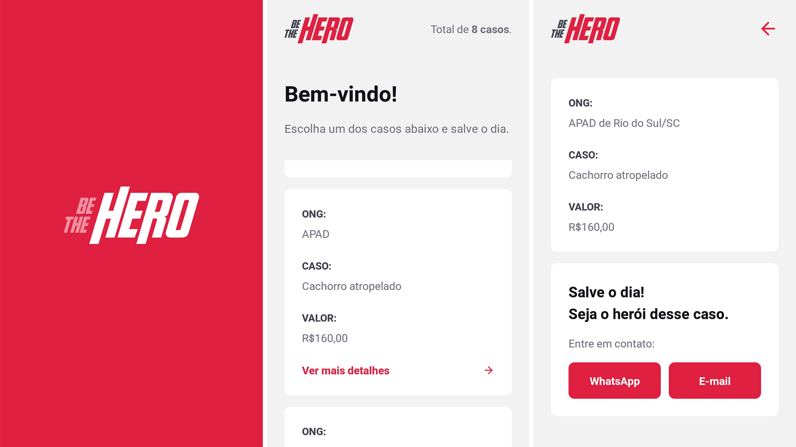
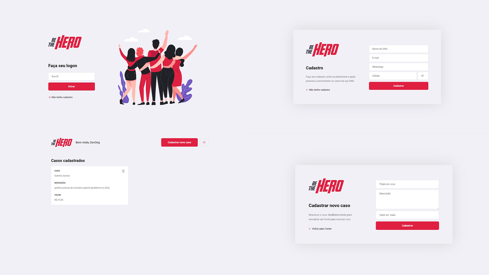

<h1 align="center">
    
</h1>

<h4 align="center"> 
	🚧  BeTheHero 💛 Concluído 🚀 🚧
</h4>

<p align="center">
 <a href="#-sobre-o-projeto">Sobre</a> •
 <a href="#-funcionalidades">Funcionalidades</a> •
 <a href="#-layout">Layout</a> • 
 <a href="#-como-executar-o-projeto">Como executar</a> • 
 <a href="#-tecnologias">Tecnologias</a> • 
 <a href="#-autor">Autor</a>
</p>


## 💻 Sobre o projeto

💛 BeTheHero - O BeTheHero é um projeto que visa conectar pessoas que desejam fazer contribuições monetárias a ONG's (Organizações não governamentais) que precisam de ajuda.


Projeto desenvolvido durante a **Semana Omnistack 11** oferecida pela [Rocketseat](https://rocketseat.com.br/).
A semana omnistack é uma experiência online com muito conteúdo prático, desafios e hacks onde o conteúdo fica disponível durante uma semana.

---

## ⚙️ Funcionalidades

- [x] Empresas ou entidades podem se cadastrar na plataforma web enviando:
  - [x] nome da ONG
  - [x] um e-mail
  - [x] número do Whatsapp
  - [x] cidade e estado 

- [x] Os usuários tem acesso ao aplicativo móvel, onde podem:
  - [x] navegar por uma lista de casos cadastrados
  - [x] entrar em contato com a entidade através do E-mail ou do WhatsApp

---

## 🎨 Layout

### Mobile

<p align="center">
  
</p>

### Web

<p align="center" style="display: flex; align-items: flex-start; justify-content: center;">
  
</p>

---

## 🚀 Como executar o projeto

Este projeto é divido em três partes:
1. Backend (pasta backend) 
2. Frontend (pasta frontend)
3. Mobile (pasta mobile)

💡Tanto o Frontend quanto o Mobile precisam que o Backend esteja sendo executado para funcionar.

### Pré-requisitos

Antes de começar, você vai precisar ter instalado em sua máquina as seguintes ferramentas:
[Git](https://git-scm.com), [Node.js](https://nodejs.org/en/). 
Além disto é bom ter um editor para trabalhar com o código como [VSCode](https://code.visualstudio.com/)

#### 🎲 Rodando o Backend (servidor)

```bash

# Clone este repositório
$ git clone https://github.com/naMoraezDev/BeTheHero-Full-Stack-App.git

# Acesse a pasta do projeto no terminal/cmd
$ cd BeTheHero-Full-Stack-App-main

# Vá para a pasta server
$ cd backend

# Instale as dependências
$ npm install 
ou 
$ yarn install

# Execute a aplicação em modo de desenvolvimento
$ npm run dev:server
ou
$ yarn dev

# O servidor inciará na porta:3333 - acesse http://localhost:3333 

```

#### 🧭 Rodando a aplicação web (Frontend)

```bash

# Clone este repositório
$ git clone https://github.com/naMoraezDev/BeTheHero-Full-Stack-App.git

# Acesse a pasta do projeto no seu terminal/cmd
$ cd BeTheHero-Full-Stack-App-main

# Vá para a pasta da aplicação Front End
$ cd frontend

# Instale as dependências
$ npm install
ou
$ yarn install

# Execute a aplicação em modo de desenvolvimento
$ npm run start
ou
$ yarn start

# A aplicação será aberta na porta:3000 - acesse http://localhost:3000

```

#### :iphone: Rodando a aplicação mobile (mobile)

```bash

# Clone este repositório
$ git clone https://github.com/naMoraezDev/BeTheHero-Full-Stack-App.git

# Acesse a pasta do projeto no seu terminal/cmd
$ cd BeTheHero-Full-Stack-App-main

# Vá para a pasta da aplicação Front End
$ cd mobile

# Instale as dependências
$ npm install
ou
$ yarn install

# Execute a aplicação em modo de desenvolvimento
$ npm run start
ou
$ yarn start

```

---

## 🛠 Tecnologias

As seguintes ferramentas foram usadas na construção do projeto:

#### **Front-End**  ([React](https://reactjs.org/))

-   **[React Dom](https://github.com/facebook/react/tree/master/packages/react-dom)**
-   **[React Router Dom](https://github.com/ReactTraining/react-router/tree/master/packages/react-router-dom)**
-   **[React Icons](https://react-icons.github.io/react-icons/)**
-   **[Axios](https://github.com/axios/axios)**
-   **[React Scripts](https://github.com/facebook/create-react-app/tree/master/packages/react-scripts)**
-   **[testing-library/jest-dom](https://github.com/testing-library/jest-dom)**
-   **[testing-library/react](https://github.com/testing-library/react-testing-library)**
-   **[testing-library/user-event](https://github.com/testing-library/user-event)**

#### **Back-End**  ([NodeJS](https://nodejs.org/en/))

-   **[Express](https://expressjs.com/)**
-   **[CORS](https://expressjs.com/en/resources/middleware/cors.html)**
-   **[KnexJS](http://knexjs.org/)**
-   **[SQLite](https://github.com/mapbox/node-sqlite3)**

#### **Mobile**  ([React Native](http://www.reactnative.com/))

-   **[Expo Google Fonts](https://github.com/expo/google-fonts)**
-   **[React Native Masked View](https://github.com/react-native-masked-view/masked-view)**
-   **[React Navigation](https://reactnavigation.org/)**
-   **[React Navigation Stack](https://github.com/react-navigation/stack)**
-   **[Axios](https://github.com/axios/axios)**
-   **[Expo](https://expo.io/)**
-   **[Expo Constants](https://docs.expo.io/versions/latest/sdk/constants/)**
-   **[Expo Mail Composer](https://docs.expo.io/versions/latest/sdk/mail-composer/)**
-   **[Intl](https://github.com/andyearnshaw/Intl.js/)**
-   **[React Dom](https://github.com/facebook/react/tree/master/packages/react-dom)**
-   **[React Native Gesture Handler](https://github.com/software-mansion/react-native-gesture-handler)**
-   **[React Native Reanimated](https://github.com/software-mansion/react-native-reanimated)**
-   **[React Native Safe Area Context](https://github.com/th3rdwave/react-native-safe-area-context)**
-   **[React Native Screens](https://github.com/software-mansion/react-native-screens)**
-   **[React Native Web](https://github.com/necolas/react-native-web)**

---

## 💪 Como contribuir para o projeto

1. Faça um **fork** do projeto.
2. Crie uma nova branch com as suas alterações: `git checkout -b my-feature`
3. Salve as alterações e crie uma mensagem de commit contando o que você fez: `git commit -m "feature: My new feature"`
4. Envie as suas alterações: `git push origin my-feature`

---

## 🦸 Autor

Feito com ❤️ por Gabriel Moraes 👋 [Entre em contato!](https://www.linkedin.com/in/gabriel-moraes-5572b2145/)
